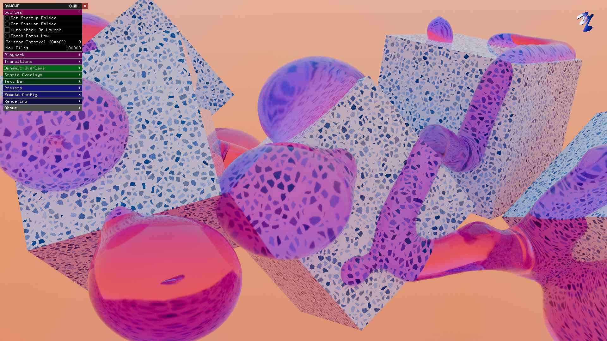

# AVWOWE

**Interactive Media Player & Kiosk System**

AVWOWE turns media collections into nonstop on-screen magic — continuous
playback, scrolling tickers, dynamic overlays, picture-in-picture layers,
live remote content, and frame-accurate PNG export. Built for home screens,
storefront displays, events, and ambient installations.

Homepage and user guide: https://avwowe.xusione.com/

> AVWOWE is proprietary software, free to use. See [LICENSE](LICENSE) for terms.
> This repository packages the application as a [Flatpak](https://flatpak.org/).



## Features

- **Always On** — point at local folders and cycle through media continuously,
  with optional automatic jump cuts for a montage look.
- **Advanced Tickers** — scrolling text bars from static text, local files, or
  live URLs, with full font/color/size/background control.
- **Dynamic Overlays** — animated or static corner watermarks, full-screen
  frames, CRT scanlines, film grain.
- **Picture in Picture** — animated JPG/PNG/GIF layers that drift, spin, and
  tilt across the display.
- **Live Content & Remote Config** — auto-detect added/removed files and pull
  live text from remote URLs without restarting.
- **High-Fidelity Export** — export compositions as frame-accurate PNG
  sequences for video rendering.

## Install

Download the `.flatpak` bundle (x86_64) from <https://avwowe.xusione.com/>
and double-click it, or install it from a terminal:

```bash
flatpak install AVWOWE-1.0.0-x86_64.flatpak
flatpak run com.xusione.AVWOWE
```

The first install also pulls the shared Freedesktop runtime, roughly 1 GB and
once only. Checksums for released bundles are in [SHA256SUMS](SHA256SUMS).

Native builds for Raspberry Pi OS (aarch64) and Ubuntu are also available from
<https://avwowe.xusione.com/>. The Flatpak is x86_64 only.

## Build the Flatpak locally

Requires `flatpak` and `flatpak-builder`, plus the Freedesktop 24.08
runtime/SDK and the ffmpeg extension for video and audio codecs:

```bash
flatpak install --user flathub org.freedesktop.Platform//24.08 org.freedesktop.Sdk//24.08 org.freedesktop.Platform.ffmpeg-full//24.08
```

```bash
flatpak-builder --user --install --force-clean build-dir com.xusione.AVWOWE.yml
flatpak run com.xusione.AVWOWE
```

To verify nothing is missing at runtime inside the sandbox:

```bash
flatpak run --command=sh com.xusione.AVWOWE \
  -c 'LD_LIBRARY_PATH=/app/lib ldd /app/bin/AVWOWE | grep "not found"'
```

## File access

By default the sandbox can read and write the usual media locations: `~/Videos`,
`~/Pictures`, `~/Music`, `~/Desktop`, `~/Downloads`, and mounted drives under
`/media`, `/run/media` and `/mnt`. That covers most USB and network-share
setups. For media anywhere else, grant the path once — it persists across
reboots and updates:

```bash
flatpak override --user com.xusione.AVWOWE --filesystem=/path/to/media
```

## Kiosk deployment

`avwowe-kiosk.service` is a host-side systemd **user** unit (it is not shipped
inside the Flatpak). Install it on the kiosk machine to auto-start and restart
the app within a graphical session:

```bash
cp avwowe-kiosk.service ~/.config/systemd/user/
systemctl --user enable --now avwowe-kiosk.service
```

Pair it with the `flatpak override` above so configured media folders remain
accessible after reboots and are picked up automatically on rescan.

## Support the project

AVWOWE is free. If it is useful to you, donations are welcome at
<https://www.xusione.com/donate/>.

## License

Copyright © 2026 XUSIONE. All rights reserved. AVWOWE is proprietary software;
use is governed by the [End User License Agreement](LICENSE).
